# Digital Sales Database Project

## Project Overview

This project  demonstrates the end-to-end design and implementation of a digital sales database solution to support product performance analysis, customer segmentation, and marketing impact assessment. The core objective is to **derive actionable business insights from digital sales data** that can inform product strategy, optimize marketing, and improve customer experience.

## Project Features
**TransactionDate**
**FirstName**
**Gender**
**ProductName**
**Category**
**Price**
**Quantity**
**Revenue**
**Country**
**Platform**
**MarketingChannel**
**NPS Score**

## Project Objectives

* Identify high-value markets and marketing platforms to guide product and marketing strategies.
* Analyze product performance by sales volume and revenue.
* Identify high-performing and underperforming marketing platforms and channels.
* Understand geographic trends in customer acquisition and revenue generation.
* Enable data-driven decisions to improve product, marketing, and customer strategies.

## Project Structure
* README.MD
* DigitalSales_Analysis.sql
* DigitalSalesCardinality.sql
* Digital Sales - Customer Data.csv
* DigitalSalesAnalysis.pbix

## Set Up and Requirements

* **SQL Server**

* **Git for Version Control**

* **Microsoft Power BI**

## Data Pipeline
1. ** Create DigitalSales Database**: Create the Digital Sales Database

 **For example** :

  

2. **Raw Data Ingestion**: Create a staging table (`tbl_stgRawData`) that is used to bulk-import unstructured CSV sales data. Staging table is vital because it ensures data validation and, cleansing, performance optimization, schema flexibility and, monitor incremental loads. In other words, a staging table provides a safe and, efficient zone between raw data ingestion and, final data storage.

**For Example**: 

3. **Import Data**: Bulk import the CSV data into the staging table.

For example:

4. **Data Profiling**: SQL queries are used to detect data anomalies like duplicated customers, pricing inconsistencies, and repeated marketing values. Use data from the Staging Table.

For example, the following querries were used to check the integrity of the table and find out whether it is normalised. 

**Repeated customer info** 

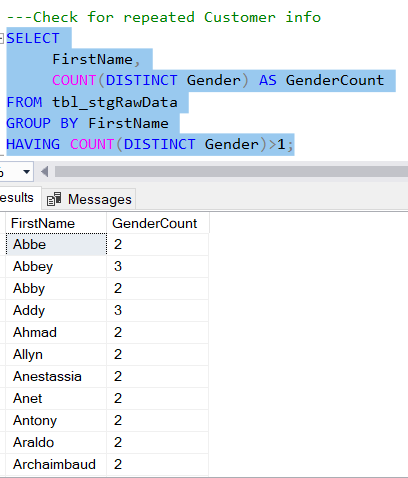

**Repeated product info** 

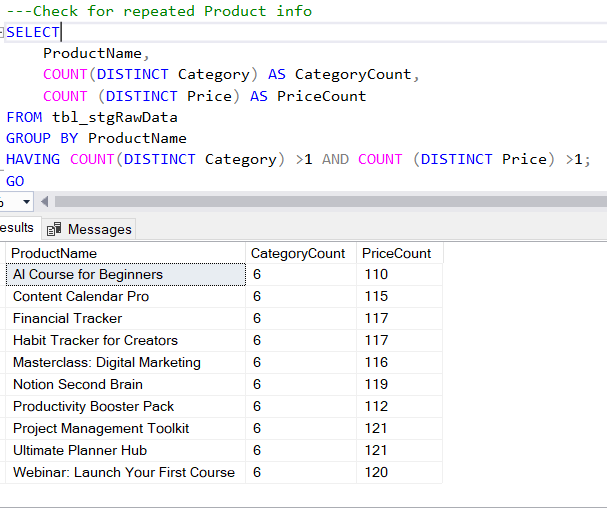

**Duplicate Platforms** 

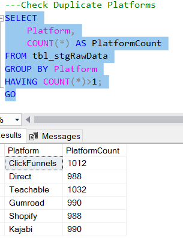

**Duplicate Marketing Channels** 

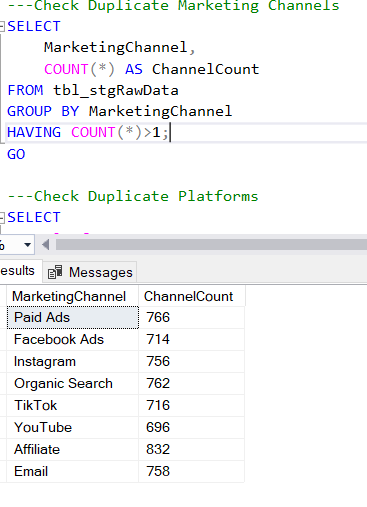

5. **Normalization**: The raw data has customer info, product info, marketing info, sales and transaction info. This means that the raw data needs to be normalised upto 3NF. Therefore, the raw data must be decomposed into four main normalized entities: The new tables are normalised ensuring that each table has a Primary Key (PK) and, where necessary a Foreign Key (FK).
   
   * Customers
   * Products
   * Marketing Channels
   * Transactions

   **Example**:

   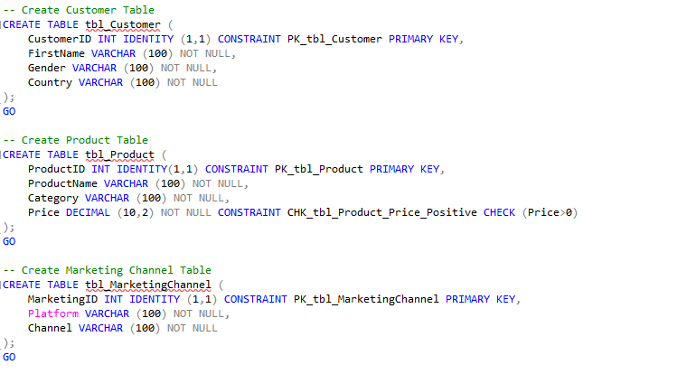

   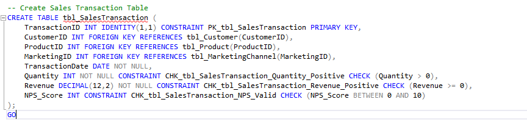

6. **Data Deduplication**: Insert data into the newly created normalised tables
  
  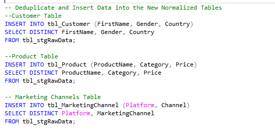

  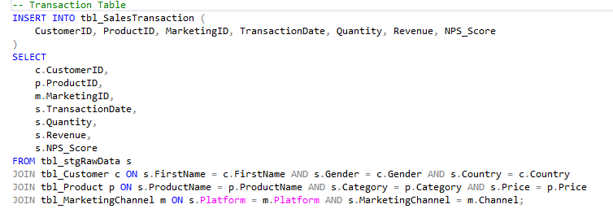

7. **Referential Integrity**: Primary and Secondary Keys are introduced for data relationships, ensuring data consistency, integrity and supporting complex joins.

8. **SQL Analysis**: The following  are a series of SQL scripts used for Analysis

**Customer Level Analysis**

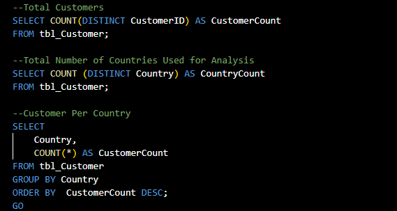

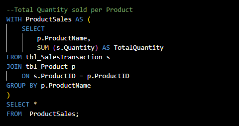

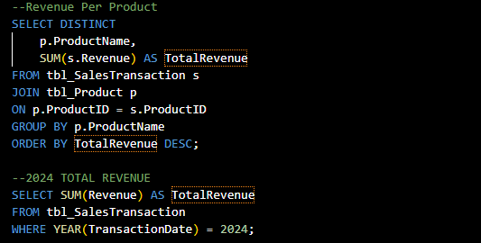

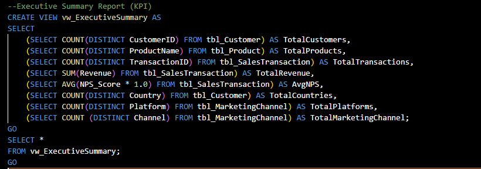

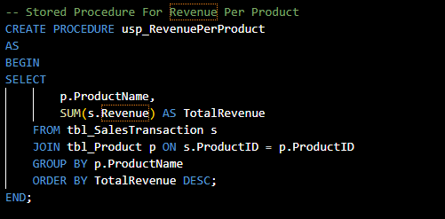

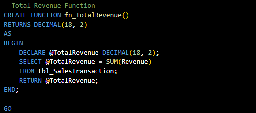

## Visualizations
I built the DigitalSales Dashboard.

## Key Analytical Findings
* **High-Level KPIs**
* Total Customers: 8946
* Total Revenue: $74.17M
* Total Transactions: 294K
* Marketing Channels: 8
* Marketing Platforms: 6

* **Key Insights**
* Top Revenue Countries
China leads clearly in revenue. Followed closely by Indonesia and then Russia.

* Product Performance
Content Calenda Pro, Webinar: Launch Your First Course and, Habit Tracker for Creators are the best performing products in revenue generation.

* Marketing Channels
Affiliate Marketing is the best marketing channel. The rest perform in a similar manner because their revenue are similar.

* Marketing Platforms
Teachable, Direct and, shopify Platforms are the best in revenue generation.

* Gender Breakdown
Male and Female customers are neck-to-neck ($33.69M & $32.16M). The other gender groups contribute less than $2M each.

**Business Value and Performance Analysis**
The revenue generated shows a strong base line, indicating success in digital sales. There is a health product-market fit as indicated by the high volume of transactions. As for the top revenue countries, localize marketing in China, Indonesia and, Russia. More marketing focus should be done in lower yielding countries to increase revenue. Promote the top three products agressively. To boost the value perception of the other products, they should be bundled.

* **Customer Trends**:
  * Highest customer base: China, Indonesia, and Russia.
  * Gender: Males and females were nearly equally distributed. Agender customers were least represented.
  * All customers completed at least one transaction, indicating 100% conversion.

* **Product Performance**:

  * 10 digital products analyzed.
  * Top seller by volume: "Content Calendar Pro" (16,524 units).
  * Lowest seller: "AI Course for Beginners" (13,991 units).
  * Most products priced uniformly at 148 or 149.

* **Marketing Insights**:

  * Affiliate marketing drove the highest revenue (\~1.8M).
  * Facebook Ads generated the least (\~1.58M).
  * Best-performing platform: Teachable (\~2.28M).
  * Lowest-performing platform: Gumroad (\~2.03M).

* **Revenue by Geography**:

  * China, Indonesia, and Russia led in customer base and revenue.
  * Dominica was the lowest revenue contributor.

* **Customer Behavior**:

  * Multiple repeat customers indicate loyalty potential.
  * Product pairs showed strong cross-sell potential.

## Entity-Relationship Design

The database follows a star schema:

| From                                          | To        | Type |
| --------------------------------------------- | --------- | ---- |
| tbl\_Customer → tbl\_SalesTransaction         | 1-to-Many |      |
| tbl\_Product → tbl\_SalesTransaction          | 1-to-Many |      |
| tbl\_MarketingChannel → tbl\_SalesTransaction | 1-to-Many |      |

`tbl_SalesTransaction` acts as the **Fact Table**, centralizing metrics and linking dimension tables.

**For Example**:

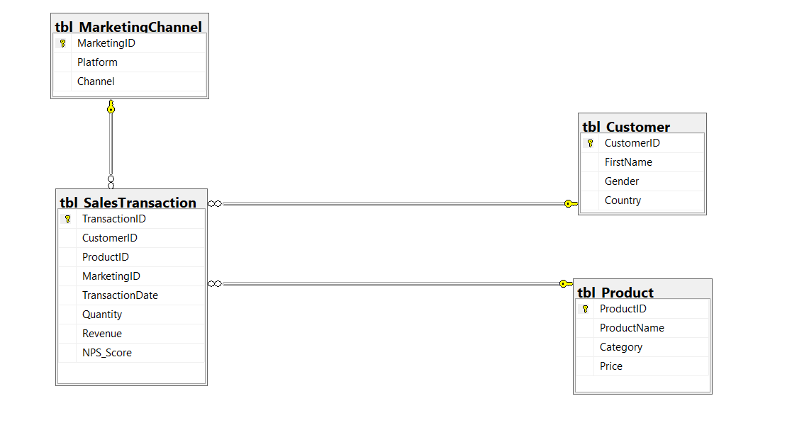

## Technical Enhancements

* **Stored Procedures**: `usp_ShowSales`, `usp_RevenuePerProduct`
* **Functions**: `fn_TotalRevenue`
* **Views**: `vw_ExecutiveSummary`, `vw_ProductRevenueByCountry`
* **Indexes**: On foreign key fields for optimized query performance

## Recommendations

* **Target High-Revenue Countries**: Focus marketing and product expansion in China, Indonesia, and Russia, as they have the largest customer bases and revenue potential.
* **Invest in Top Channels and Platforms**: Prioritize Affiliate marketing and Teachable for campaigns due to their superior performance. Consider reallocating budgets away from underperforming platforms like Facebook Ads and Gumroad.
* **Introduce Loyalty Programs**: Engage repeat customers through loyalty rewards or exclusive offers to increase retention and advocacy.
* **Bundle Complementary Products**: Use co-purchase trends to develop bundled offerings (e.g., Content Calendar Pro + Productivity Booster Pack).
* **Explore Underperforming Products**: Reposition or improve lower-selling items like "AI Course for Beginners" through pricing adjustments or targeted promotions.
* **Optimize NPS Feedback Loops**: Leverage channel- and platform-specific NPS to prioritize UX improvements and boost satisfaction.
* **Expand Demographic Data**: Enrich customer profiles with behavioral or demographic information to power advanced segmentation.

## Summary

This project demonstrates how relational databases can transform messy sales data into clear, powerful insights. Through careful schema design, normalization, analytical reporting and, visualization, businesses gain the tools to make smarter decisions. The analysis not only identifies revenue drivers and customer trends but also offers strategies for increased engagement, optimized campaigns, and scalable growth.
